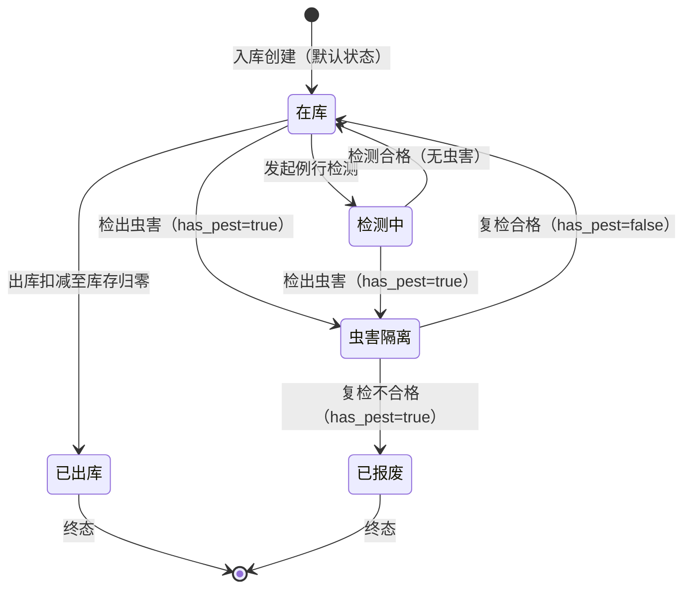
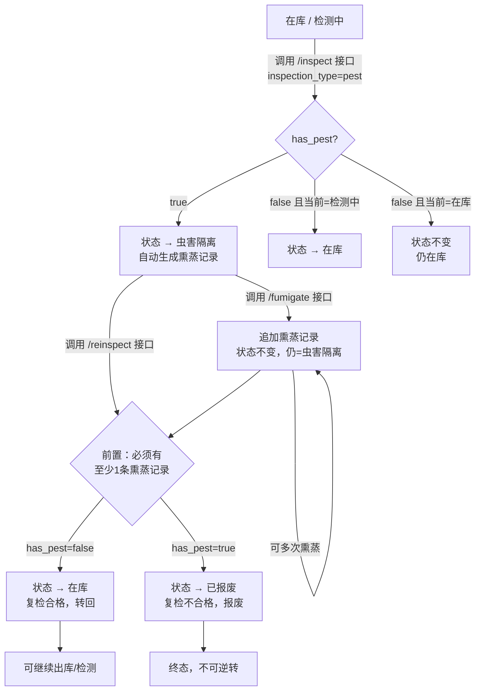
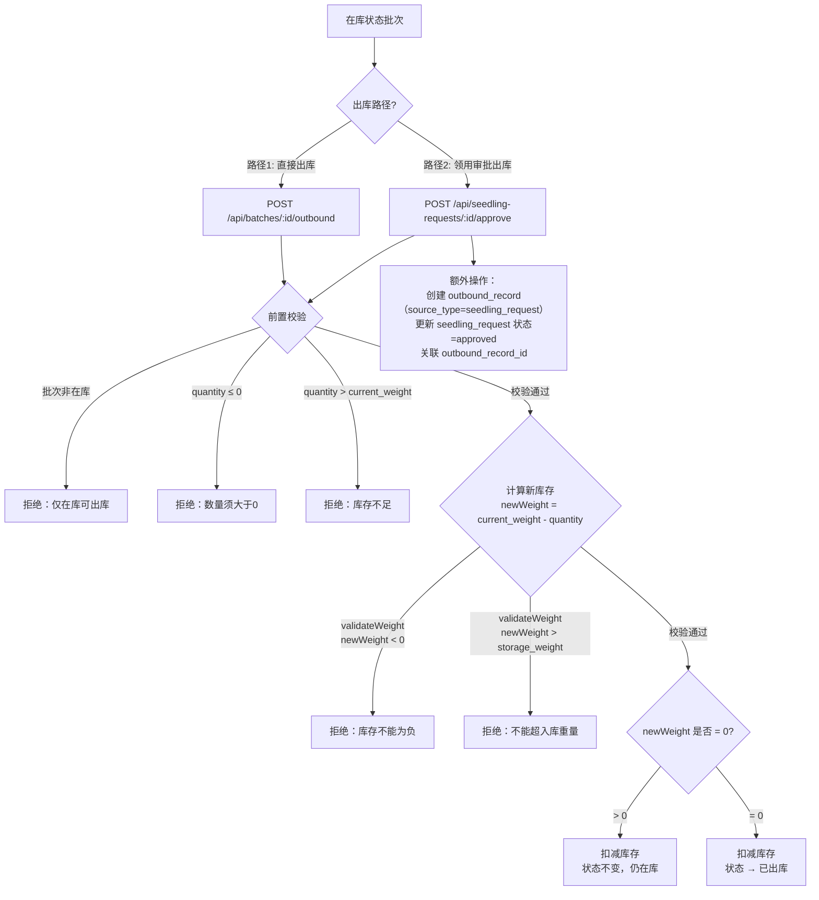
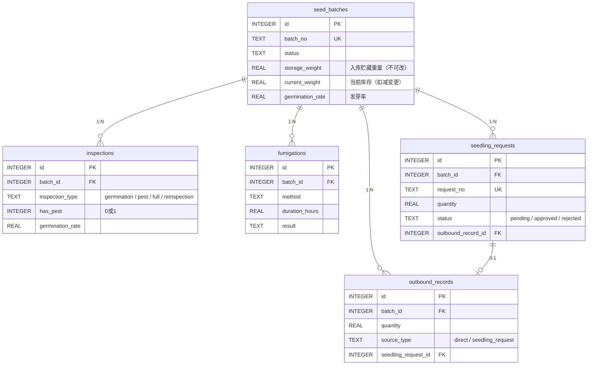

# 种子批次状态机与业务流程说明书

## 一、状态枚举

| 枚举值 | 中文标签 | 性质 |
|---|---|---|
| `in_stock` | 在库 | 可流转 |
| `testing` | 检测中 | 可流转 |
| `pest_isolated` | 虫害隔离 | 可流转 |
| `shipped_out` | 已出库 | **终态** |
| `scrapped` | 已报废 | **终态** |

> 终态批次禁止任何状态变更、修改、删除、出库、检测、熏蒸、复检操作。

定义位置：[app.js](file:///Users/ding/Documents/SOLOCODE%203/0612/macmini/zj-00263-seedvault-5/src/app.js#L10-L24)

---

## 二、状态机总图



### 合法转换矩阵

代码定义位置：[STATUS_TRANSITIONS](file:///Users/ding/Documents/SOLOCODE%203/0612/macmini/zj-00263-seedvault-5/src/app.js#L38-L44)

| 从 ↓ \ 到 → | 在库 | 检测中 | 虫害隔离 | 已出库 | 已报废 |
|---|---|---|---|---|---|
| **在库** | — | ✅ | ✅ | ✅ | — |
| **检测中** | ✅ | — | ✅ | — | — |
| **虫害隔离** | ✅ | — | — | — | ✅ |
| **已出库** | — | — | — | — | — |
| **已报废** | — | — | — | — | — |

> 空白格 = 不允许直接转换。每次转换都经过 `validateStatusChange()` 校验。

---

## 三、流程一：虫害处理流程

### 3.1 流程图



### 3.2 各环节详解

#### 环节 1：检出虫害 → 转隔离

- **接口**：`POST /api/batches/:id/inspect`
- **前置条件**：
  - 批次非终态
  - 请求体含 `inspection_type` = `"pest"` 或 `"full"`，且 `has_pest` = `true`
- **处理逻辑**：
  1. 写入 `inspections` 表（`inspection_type` = `"pest"`）
  2. 批次状态改为 `pest_isolated`
  3. **自动**创建一条 `fumigations` 记录（默认磷化铝熏蒸、72小时），无需单独调用熏蒸接口
- **代码位置**：[inspect 接口](file:///Users/ding/Documents/SOLOCODE%203/0612/macmini/zj-00263-seedvault-5/src/app.js#L338-L464)

#### 环节 2：熏蒸处理

- **接口**：`POST /api/batches/:id/fumigate`
- **前置条件**：
  - 批次**必须**处于 `pest_isolated` 状态
  - 提供 `method`（熏蒸方法）和 `duration_hours`（时长）
- **处理逻辑**：
  1. 写入 `fumigations` 表
  2. 状态不变，仍为 `pest_isolated`
  3. 可多次追加熏蒸记录（强化熏蒸场景）
- **代码位置**：[fumigate 接口](file:///Users/ding/Documents/SOLOCODE%203/0612/macmini/zj-00263-seedvault-5/src/app.js#L466-L507)

#### 环节 3：复检

- **接口**：`POST /api/batches/:id/reinspect`
- **前置条件**：
  - 批次**必须**处于 `pest_isolated` 状态
  - 该批次**必须**已有至少1条熏蒸记录（`hasFumigationRecord()` 校验）
  - 提供 `has_pest` 字段
- **处理逻辑**：

| 复检结果 | 目标状态 | 说明 |
|---|---|---|
| `has_pest` = `false` | `in_stock`（在库） | 复检合格，转回可出库 |
| `has_pest` = `true` | `scrapped`（已报废） | 复检不合格，进入终态 |

- **代码位置**：[reinspect 接口](file:///Users/ding/Documents/SOLOCODE%203/0612/macmini/zj-00263-seedvault-5/src/app.js#L509-L586)

### 3.3 虫害流程状态轨迹汇总

```
在库 ──(检出虫害)──→ 虫害隔离 ──(熏蒸)──→ 虫害隔离 ──(复检合格)──→ 在库
                                              │
                                              └──(复检不合格)──→ 已报废[终态]

检测中 ──(检出虫害)──→ 虫害隔离 ──(同上流程)
```

---

## 四、流程二：出库扣减流程

### 4.1 流程图



### 4.2 两条出库路径对比

| 维度 | 直接出库 | 领用审批出库 |
|---|---|---|
| **入口接口** | `POST /api/batches/:id/outbound` | `POST /api/seedling-requests/:id/approve` |
| **适用场景** | 直接领用，无需审批 | 需提交申请 → 审批 → 自动出库 |
| **批次状态要求** | 必须为 `in_stock` | 必须为 `in_stock` |
| **申请单状态要求** | 不涉及 | 必须为 `pending` |
| **扣减逻辑** | `current_weight -= quantity` | `current_weight -= request.quantity` |
| **出库记录来源标记** | `source_type = "direct"` | `source_type = "seedling_request"` |
| **库存归零后** | 状态 → `shipped_out` | 状态 → `shipped_out` |
| **代码位置** | [outbound 接口](file:///Users/ding/Documents/SOLOCODE%203/0612/macmini/zj-00263-seedvault-5/src/app.js#L588-L677) | [approve 接口](file:///Users/ding/Documents/SOLOCODE%203/0612/macmini/zj-00263-seedvault-5/src/app.js#L959-L1093) |

### 4.3 防负数三重保障

| 层级 | 校验点 | 代码位置 | 说明 |
|---|---|---|---|
| **第1层** | `quantity > batch.current_weight` | [outbound L614](file:///Users/ding/Documents/SOLOCODE%203/0612/macmini/zj-00263-seedvault-5/src/app.js#L614-L618) / [approve L991](file:///Users/ding/Documents/SOLOCODE%203/0612/macmini/zj-00263-seedvault-5/src/app.js#L991-L995) | 出库前直接比较，数量超库存即拒绝 |
| **第2层** | `newWeight < 0` （validateWeight 函数内） | [validateWeight L83](file:///Users/ding/Documents/SOLOCODE%203/0612/macmini/zj-00263-seedvault-5/src/app.js#L83-L91) | 计算扣减后重量，若为负则拒绝 |
| **第3层** | `newWeight > batch.storage_weight` （validateWeight 函数内） | [validateWeight L87](file:///Users/ding/Documents/SOLOCODE%203/0612/macmini/zj-00263-seedvault-5/src/app.js#L87-L88) | 防止库存超过入库贮藏重量（数据一致性兜底） |

两条出库路径均调用同一 `validateWeight()` 函数，保证校验逻辑一致。

---

## 五、两条流程的交汇分析

### 5.1 交汇状态：`in_stock`（在库）

在库是两条流程的**唯一公共起点**，也是虫害流程的**唯一回归点**。

```
                    ┌──────── 虫害流程 ────────┐
                    │                          │
    在库 ←──(复检合格)── 虫害隔离 ──(检出虫害)──→ 在库
     │                                        │
     │                                        │
     └──(出库扣减)──→ 已出库[终态]              └──(出库扣减)──→ 已出库[终态]
```

> 实际上，一旦进入 `pest_isolated`，出库路径就被阻断，直到复检合格回归 `in_stock` 才能重新出库。

### 5.2 互斥关系

| 场景 | 虫害流程 | 出库流程 | 结果 |
|---|---|---|---|
| 批次在库，无虫害 | 不触发 | 可执行 | ✅ 可出库 |
| 批次在库，检出虫害 | 转隔离 | **被阻断** | ❌ 只能走虫害流程 |
| 批次虫害隔离中 | 熏蒸/复检 | **被阻断** | ❌ 不允许出库 |
| 批次复检合格回在库 | 流程结束 | 恢复可执行 | ✅ 可出库 |
| 批次复检不合格报废 | 终态 | **永久阻断** | ❌ 不可出库 |
| 批次出库后库存归零 | **被阻断** | 终态 | ❌ 不可检测 |

### 5.3 各流程前置条件速查

#### 虫害流程前置条件

| 操作 | 前置状态 | 额外条件 |
|---|---|---|
| 检测（检出虫害） | `in_stock` 或 `testing` | `has_pest = true` |
| 熏蒸 | `pest_isolated` | 提供 method 和 duration_hours |
| 复检 | `pest_isolated` | 已有 ≥1 条熏蒸记录 |

#### 出库流程前置条件

| 操作 | 前置状态 | 额外条件 |
|---|---|---|
| 直接出库 | `in_stock` | `0 < quantity ≤ current_weight` |
| 提交领用申请 | `in_stock` | `0 < quantity ≤ current_weight` |
| 审批领用（出库） | 批次 `in_stock` 且申请 `pending` | `quantity ≤ current_weight`（审批时二次校验） |

> **关键设计**：领用审批出库时，会**二次校验**库存，防止提交申请后、审批前库存被其他出库操作扣减导致超卖。

---

## 六、数据模型关联



---

## 七、状态变更约束规则

1. **通用编辑接口不可改状态和库存**：`PUT /api/batches/:id` 显式拒绝修改 `status`、`current_weight`、`storage_weight`，必须走业务流程接口
2. **终态不可逆**：`shipped_out` 和 `scrapped` 为终态，所有写操作均被拦截
3. **状态转换白名单**：由 `STATUS_TRANSITIONS` 字典硬编码，不在白名单内的转换一律拒绝
4. **事务一致性**：出库和复检操作均使用 SQLite 事务（`db.transaction()`），保证库存扣减与状态变更的原子性

定义位置：
- [validateStatusChange](file:///Users/ding/Documents/SOLOCODE%203/0612/macmini/zj-00263-seedvault-5/src/app.js#L63-L81)
- [isValidStatusTransition](file:///Users/ding/Documents/SOLOCODE%203/0612/macmini/zj-00263-seedvault-5/src/app.js#L54-L57)
- [通用编辑约束](file:///Users/ding/Documents/SOLOCODE%203/0612/macmini/zj-00263-seedvault-5/src/app.js#L255-L277)
